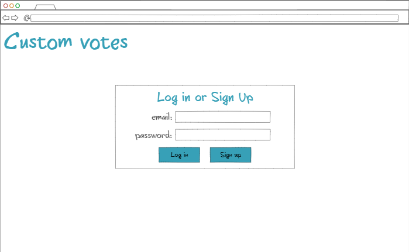
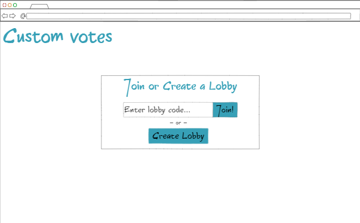
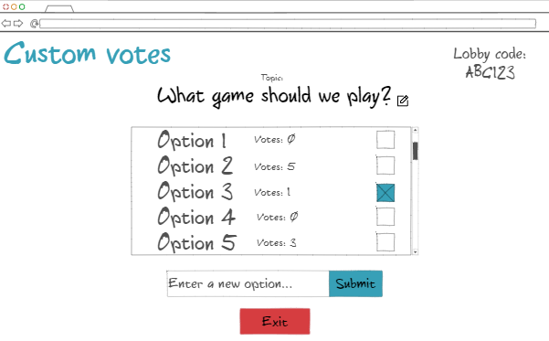

# startup- Custon Votes

This is my startup application for BYU CS 260.

## Notes

These are my [notes](Notes/notes.md) for what I have learned during this course.

## Specification Deliverable

### Elevator Pitch:

Often times it can be difficult to reach a decision when you are working with a large group of people, especially when you have to work with them over the internet. It is a challenge to gather everyone's input and even list all of the options in the first place. The Custom Votes application seeks to solve these problems by providing a simple user interface, giving you only the options you *want*. Custom Votes provides private lobbies where users can create a topic and then add custom options which can then be voted on by those with the lobby code. Every user is able to enter their input, ensuring that no option is left behind. The votes are tallied up in realtime, offering a clear winner and a decision made. Say goodbye to longwinded debates about where to eat, or which video game to play by using Custom Votes.

### Design:

The inital screen for the user.

Once logged in, the user can either join or create a private lobby.

The lobby displays the lobby code and topic at the top, as well as the options, how many votes they have, and the ability to cast a vote. The user can also submit new options or exit the lobby.

### Key Features:

- Secure login
- Private lobbies with unique codes
- Ability to join an active lobby or create a new one
- Customizable topic for each lobby
- Custom options that can be submitted by users
- Ability to select an option as a vote anonymously
- Options and votes are updated in realtime

### Technologies:

- **HTML** - Application uses HTML structure with three HTML pages.
- **CSS** - Allows application to adjust to different screen sizes and uses a color palette that isn't repulsive and is colorblind friendly.
- **JavaScript** - Application has buttons to login, join or create lobbies, enter text for topics and options, cast and display votes.
- **Service** - Backend service with endpoints for:
  - login
  - creation of lobbies
  - submitting votes
  - retriving vote status
- **DB/Login** - Users can't join or create a lobby unless they are auithenticated. Users, topics, options, and votes are stored in database.
- **Websocket** - The topic of the lobby as well as options and votes are broadcast to other users in the lobby.

## HTML Deliverable

- **HTML pages** - I included 4 html pages for logging in, joining a lobby, voting, and an about page
- **HTML tags** - Each page has head, nav, body, header, main, and footer tags
- **Links** - The login page links to the join/create page which links to the lobby page. Every page contains links in the navigation bar to the pther pages as well as the about page and in the footer of each page is a link to my GitHub respository
- **Text** - Each page contains short instructions for the various features and buttons and the about page contains information about the site
- **3rd Party Service** - The lobby code on the lobby screen will be attrivuted to a 3rd party service.
- **Images** - The about page has a picture of me :/)
- **Login** - The home page has a placeholder to log in
- **Database** - The options on the lobby page will be stored in a database
- **Websocket** - The lobby title as well as the options and the votes for each option will all be updated for the user in realtime
