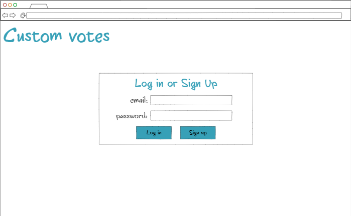
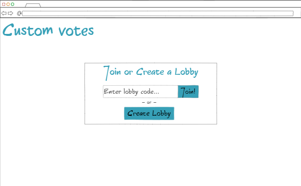
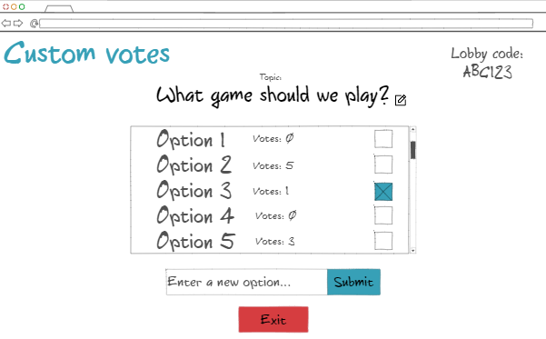

# startup- Custon Votes

This is my startup application for BYU CS 260.

## Notes

These are my [notes](notes.md) for what I have learned during this course.

## Specification Deliverable

### Elevator Pitch:

Often times it can be difficult to reach a decision when you are working with a large group of people, especially when you have to work with them over the internet. It is a challenge to gather everyone's input and even list all of the options in the first place. The Custom Votes application seeks to solve these problems by providing a simple user interface, giving you only the options you *want*. Custom Votes provides private lobbies where users can create a topic and then add custom options which can then be voted on by those with the lobby code. Every user is able to enter their input, ensuring that no option is left behind. The votes are tallied up in realtime, offering a clear winner and a decision made. Say goodbye to longwinded debates about where to eat, or which video game to play by using Custom Votes.

### Design:

The inital screen for the user.

Once logged in, the user can either join or create a private lobby.

The lobby displays the lobby code and topic at the top, as well as the options, how many votes they have, and the ability to cast a vote. The user can also submit new options or exit the lobby.

### Key Features:

- Secure login
- Private lobbies with unique codes
- Ability to join an active lobby or create a new one
- Customizable topic for each lobby
- Custom options that can be submitted by users
- Ability to select an option as a vote
- Options and votes are updated in realtime
